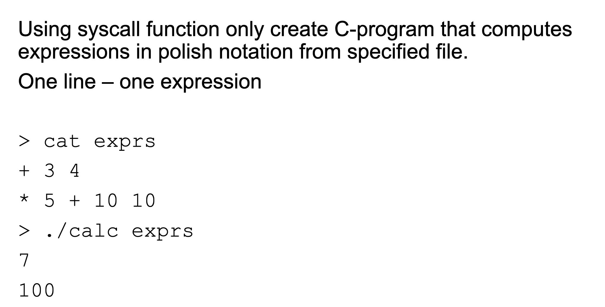

https://man7.org/linux/man-pages/man2/syscall.2.html

## exmpl
```c++
#define _GNU_SOURCE
#include <signal.h>
#include <sys/syscall.h>
#include <sys/types.h>
#include <unistd.h>

int
main(void)
{
   pid_t tid;

   tid = syscall(SYS_gettid);
   syscall(SYS_tgkill, getpid(), tid, SIGHUP);
}
```

https://manpages.debian.org/unstable/manpages-dev/open.2.en.html


RETURN VALUE

On success, open(), openat(), and creat() return the new file descriptor (a nonnegative integer). On error, -1 is returned and errno is set to indicate the error.


https://filippo.io/linux-syscall-table/
